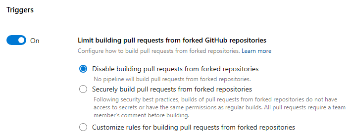
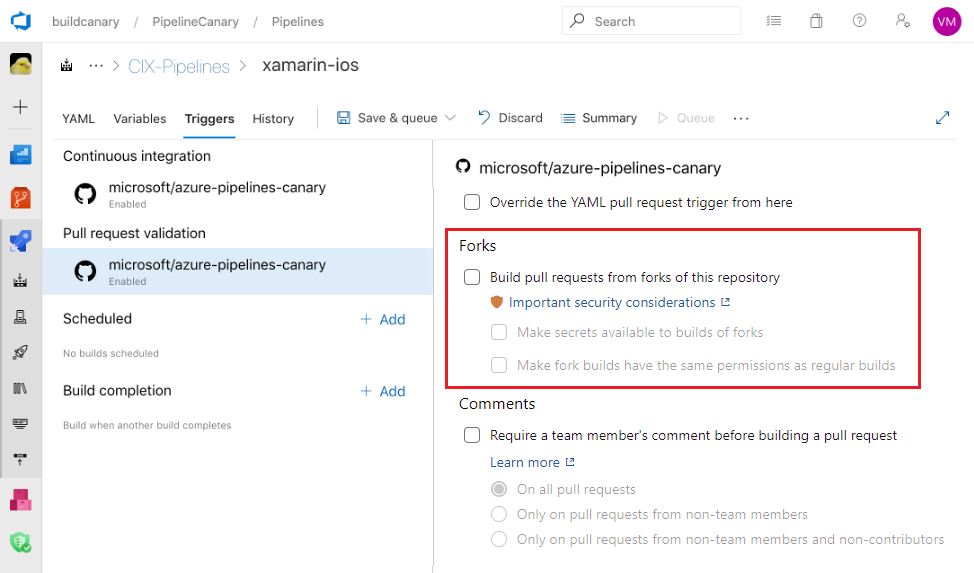

## Description

The workflow appears to checkout untrusted code from a fork and uses a command that is known to allow code execution. 

Using workflows with `pull_request_target` has the added benefit (as opposed to `pull_request`) of allowing access to secrets even in forked repositories. There can be good reasons to do so if you need to use API Keys to talk to some external services or want to interact with the GitHub API with `write` permissions. However, this comes at the cost of paying extra attention to the tools you use in your workflow.

So-called "Living Off The Pipeline" tools are common development tools (typically CLIs), commonly used in CI/CD pipelines that have lesser-known RCE-By-Design features ("foot guns") that can be abused to execute arbitrary code. These tools are often used to automate tasks such as compiling, testing, packaging, linting or scanning. The gotcha comes from the fact that many of those tools will consume unutrusted input from files on disk and when you checkout untrusted code from a fork, you are effectively allowing the attacker to control the input to those tools.

## Remediation

### GitHub Actions

#### Recommended

##### Using labels

Make it mandatory to label the PR with a specific label before the workflow runs. This way, you can ensure that only PRs that are labeled with the specific label are allowed to run the workflow.

Adding a label to a pull request can only be performed by users with write access to the repository. This means that the attacker would need to have write access to the repository to add the label to the pull request.

IMPORTANT NOTE: The hypotethical `npm run lint` command used here, assumes that it will process files in the `untrusted` directory. If your actual tool is not designed to process files in a specific directory, you should consider using a different approach to prevent code execution.

The following example not only checks for the label, but is also coded defensively to run trusted linting scripts, despite needing access to secrets.

```yaml
on:
  pull_request_target:
    branches: [main]
    types: [labeled]
permissions: {}
jobs:
  lint:
    runs-on: ubuntu-latest
    if: github.event.label.name == 'safe-to-run'
    permissions:
      contents: read
      pull-requests: write
    steps:
    - name: Checkout trusted code from protected branch
      uses: actions/checkout@b4ffde65f46336ab88eb53be808477a3936bae11 # v4.1.1
      with:
        ref: main
        persist-credentials: false
        path: trusted
    - name: Install trusted dependencies
      working-directory: trusted
      run: npm ci

    - name: Checkout untrusted code
      uses: actions/checkout@b4ffde65f46336ab88eb53be808477a3936bae11 # v4.1.1
      with:
        repository: ${{ github.event.pull_request.head.repo.full_name }}
        ref: ${{ github.event.pull_request.head.sha }}
        persist-credentials: false
        path: untrusted
    - name: Run linting script on untrusted code
      id: untrusted-code-lint
      working-directory: trusted
      env:
        LINTING_TOOL_API_KEY: ${{ secrets.LINTING_TOOL_API_KEY }}
      run: |
        RAND_DELIMITER="$(openssl rand -hex 16)" # 128-bit random delimiter token
        echo "tainted<<${RAND_DELIMITER}" >> "${GITHUB_OUTPUT}"
        echo "$(npm run lint --ignore-scripts $GITHUB_WORKSPACE/untrusted/)" >> "${GITHUB_OUTPUT}"
        echo "${RAND_DELIMITER}" >> "${GITHUB_OUTPUT}"
    - name: Output linting results to Pull Request
      uses: actions/github-script@60a0d83039c74a4aee543508d2ffcb1c3799cdea # v7.0.1
      env:
        UNTRUSTED_CODE_TAINTED_LINT_RESULTS: ${{ steps.untrusted-code-lint.outputs.tainted }}
      with:
        script: |
          const { UNTRUSTED_CODE_TAINTED_LINT_RESULTS } = process.env
          github.rest.issues.createComment({
              issue_number: context.issue.number,
              owner: context.repo.owner,
              repo: context.repo.repo,
              body: `👋 Thanks for your contribution.\nHere are the linting results:\n${UNTRUSTED_CODE_TAINTED_LINT_RESULTS}`
          })
```

##### Using environments

You should limit the number of simple Actions secrets and prefer the use environments to store secrets to restrict the execution of the workflow to specific environments. This way, you can ensure that only PRs that are targeting the specific environment are allowed to run the workflow. And you can configure the environment to be protected and require approval before the workflow runs.

IMPORTANT NOTE: The hypotethical `npm run lint` command used here, assumes that it will process files in the `untrusted` directory. If your actual tool is not designed to process files in a specific directory, you should consider using a different approach to prevent code execution.

The following example is very similar to the previous, but uses environments and stores the `LINTING_TOOL_API_KEY` in the environment.

```yaml
on:
  pull_request_target:
    branches: [main]
    types: [opened, synchronize]
permissions: {}
jobs:
  lint:
    runs-on: ubuntu-latest
    environment: untrusted-pull-request-from-forks
    permissions:
      contents: read
      pull-requests: write
    steps:
    - name: Checkout trusted code from protected branch
      uses: actions/checkout@b4ffde65f46336ab88eb53be808477a3936bae11 # v4.1.1
      with:
        ref: main
        persist-credentials: false
        path: trusted
    - name: Install trusted dependencies
      working-directory: trusted
      run: npm ci

    - name: Checkout untrusted code
      uses: actions/checkout@b4ffde65f46336ab88eb53be808477a3936bae11 # v4.1.1
      with:
        repository: ${{ github.event.pull_request.head.repo.full_name }}
        ref: ${{ github.event.pull_request.head.sha }}
        persist-credentials: false
        path: untrusted
    - name: Run linting script on untrusted code
      id: untrusted-code-lint
      working-directory: trusted
      env:
        LINTING_TOOL_API_KEY: ${{ secrets.LINTING_TOOL_API_KEY }}
      run: |
        RAND_DELIMITER="$(openssl rand -hex 16)" # 128-bit random delimiter token
        echo "tainted<<${RAND_DELIMITER}" >> "${GITHUB_OUTPUT}"
        echo "$(npm run lint --ignore-scripts $GITHUB_WORKSPACE/untrusted/)" >> "${GITHUB_OUTPUT}"
        echo "${RAND_DELIMITER}" >> "${GITHUB_OUTPUT}"
    - name: Output linting results to Pull Request
      uses: actions/github-script@60a0d83039c74a4aee543508d2ffcb1c3799cdea # v7.0.1
      env:
        UNTRUSTED_CODE_TAINTED_LINT_RESULTS: ${{ steps.untrusted-code-lint.outputs.tainted }}
      with:
        script: |
          const { UNTRUSTED_CODE_TAINTED_LINT_RESULTS } = process.env
          github.rest.issues.createComment({
              issue_number: context.issue.number,
              owner: context.repo.owner,
              repo: context.repo.repo,
              body: `👋 Thanks for your contribution.\nHere are the linting results:\n${UNTRUSTED_CODE_TAINTED_LINT_RESULTS}`
          })
```

#### Anti-Pattern

This example contains several things that could be improved to make the workflow more secure.

```yaml
# (1) Triggers on `pull_request_target`, no scoping to protected branch, no scoping to selected events
on: pull_request_target

# (2) Using default permissions for automatic token

jobs:
  lint:
    runs-on: ubuntu-latest
    # (3) Runs unconditionnally (no label, no environment)
    steps:
    - name: Checkout untrusted code
      uses: actions/checkout@v4 # (4) Missing pinning
      with:
        repository: ${{ github.event.pull_request.head.repo.full_name }}
        ref: ${{ github.event.pull_request.head.sha }}
        # (5) Persisting credentials is not necessary - Though this is not a panacea, credentials can still be dumped from memory
        # (6) Checking untrusted code in default workspace path - In this scenario, it's good to explicitely define the path with untrusted code
    - name: Install dependencies
      run: npm install # (7) Should use `npm ci` instead, this will allow attack to install any package
    - name: Run linting script
      id: lint
      env:
        LINTING_TOOL_API_KEY: ${{ secrets.LINTING_TOOL_API_KEY }}
      run: |
        echo "results<<EOF" >> "${GITHUB_OUTPUT}" # (8) Untrusted output could output more that just `results` because EOF delimiter is known to the attacker
        echo "$(npm run lint)" >> "${GITHUB_OUTPUT}" # (9) RCE-by-design (npm will consume untrusted `package.json` and execute arbitrary code)
        echo "EOF" >> "${GITHUB_OUTPUT}"
    - name: Output linting results to Pull Request
      uses: actions/github-script@v7 # (10) Missing pinning
      with:
        script: |
          github.rest.issues.createComment({
              issue_number: context.issue.number,
              owner: context.repo.owner,
              repo: context.repo.repo,
              body: `👋 Thanks for your contribution.\nHere are the linting results:\n${{ steps.lint.outputs.results }}` // (11) Second-order Injection
          })
```

### Azure DevOps

#### Caveat
False positives are likely given that static analysis of solely the pipeline file is not enough to confirm exploitability

#### Recommended
##### Azure DevOps Settings
Organization Setting:


Avoid activating the following settings to prevent issues:


```yaml
pr:
  - main

pool:
  vmImage: ubuntu-latest

variables:
  - name: someVariable
    value: someValue

steps:
  - checkout: self
    path: trusted
  - script: npm ci
    workingDirectory: trusted

```

#### Anti-Pattern
    
```yaml
pr:
  - main

pool:
  vmImage: ubuntu-latest

variables:
  - name: someVariable
    value: someValue

steps:
  - checkout: self
  - script: npm install

```

## See Also
- [Keeping your GitHub Actions and workflows secure Part 1: Preventing pwn requests](https://securitylab.github.com/research/github-actions-preventing-pwn-requests/)
- [Erosion of Trust: Unmasking Supply Chain Vulnerabilities in the Terraform Registry](https://boostsecurity.io/blog/erosion-of-trust-unmasking-supply-chain-vulnerabilities-in-the-terraform-registry)
- [The tale of a Supply Chain near-miss incident](https://boostsecurity.io/blog/the-tale-of-a-supply-chain-near-miss-incident)
- [Living Off The Pipeline](https://boostsecurityio.github.io/lotp/)
- https://learn.microsoft.com/en-us/azure/devops/pipelines/repos/github?view=azure-devops&tabs=yaml#important-security-considerations
- https://learn.microsoft.com/en-us/azure/devops/pipelines/security/misc?view=azure-devops#dont-provide-secrets-to-fork-builds
